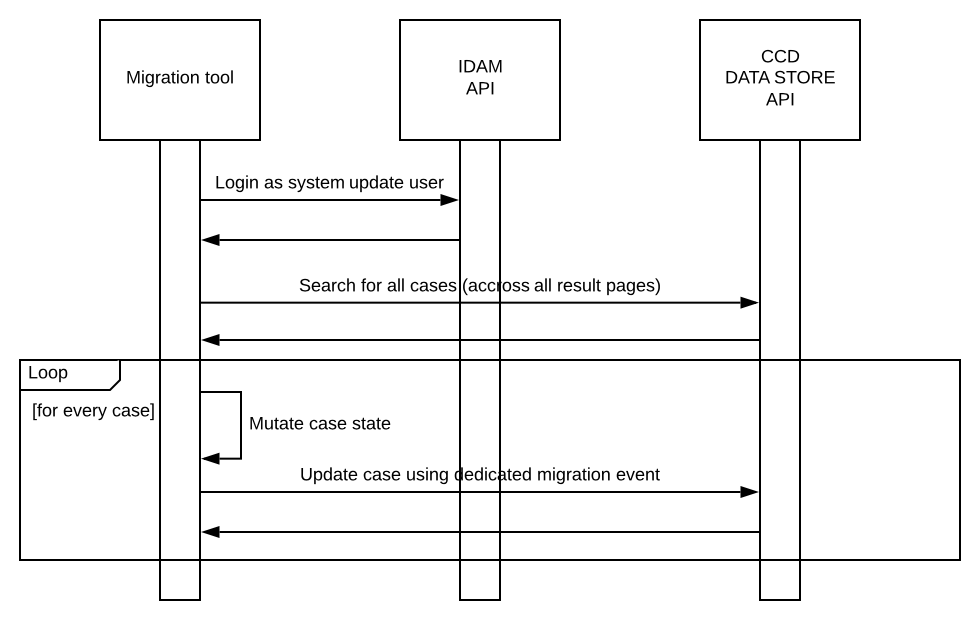

# ccd-case-migration-starter

CCD Case Migration Starter provides a framework for data migrations within CCD , to assist with case migrations that are required when the case definition changes in a way that requires existing cases to be updated to match the new case definition.

The framework runs the following process :-



The source code is maintained as a template within GitHub and is typically either cloned by a service team to establish a migration capability , or branched within the repository.

CCD Case Migration Starter framework source code is located in HMCTS GitHub repository  https://github.com/hmcts/ccd-case-migration-starter

It is built by Jenkins using HMCTS Jenkins job  https://build.platform.hmcts.net/job/HMCTS_a_to_c/job/ccd-case-migration-starter/

## Getting started

To utilise the CCD Case Migration Starter :-

1. Clone the GitHub repository and create a branch for the migration task.

2. Make the required source code changes for the migration task (see section below).

3. Create a pull request.

4. Request PlatOps to copy the JAR that was built using the pipeline from the repository to the bastion server for operation.

## Required source code changes

As a minimum , the source code changes described below should be made.

Create a Java class which implements `uk.gov.hmcts.reform.migration.service.DataMigrationService` interface in similar way as shown below :-

```java
package uk.gov.hmcts.reform.migration.service;

import org.springframework.stereotype.Component;
import uk.gov.hmcts.reform.ccd.client.model.CaseDetails;

import java.util.function.Predicate;

@Component
public class DataMigrationServiceImpl implements DataMigrationService {
    @Override
    public Predicate<CaseDetails> accepts() {
        return true; // Predicate that allows to narrow number of cases that gets migrated
    }

    @Override
    public void migrate(CaseDetails caseDetails) {
        // Case data migration logic goes here
    }
}
```

Ensure that the application properties below are configured as required in `application.properties` file :-

```properties
idam.api.url= # IDAM API URL used to authenticate system update user (pointing to localhost version of IDAM API by default)
idam.client.id= # IDAM OAuth2 client ID used to authenticate system update user
idam.client.secret= # IDAM OAuth2 client secret used to authenticate system update user
idam.client.redirect_uri= # IDAM OAuth2 redirect URL used to authenticate system update user

idam.s2s-auth.url= # S2S API URL used to authenticate service (pointing to localhost version of S2S API by default)
idam.s2s-auth.microservice= # S2S micro service name used to authenticate service
idam.s2s-auth.totp_secret= # S2S micro service secret used to authenticate service

core_case_data.api.url= # CCD data store API URL used to fetch / update case details (pointing to localhost version of CCD by default)

migration.idam.username= # IDAM username of a system update user that performs data migration
migration.idam.password= # IDAM password of a system update user that performs data migration
migration.jurisdiction= # CCD jurisdiction that data migration is run against
migration.casetype= # CCD case type that data migration is run against
migration.caseId= # optional CCD case ID in case only one case needs to be migrated

case-migration.elasticsearch.querySize= # Elasticsearch query size limit
case-migration.processing.limit= # Migration processing size limit
```

## Unit tests

To run all unit tests please execute following command :-

```bash
    ./gradlew test
```

## License

This project is licensed under the MIT License - see the [LICENSE](LICENSE) file for details.
